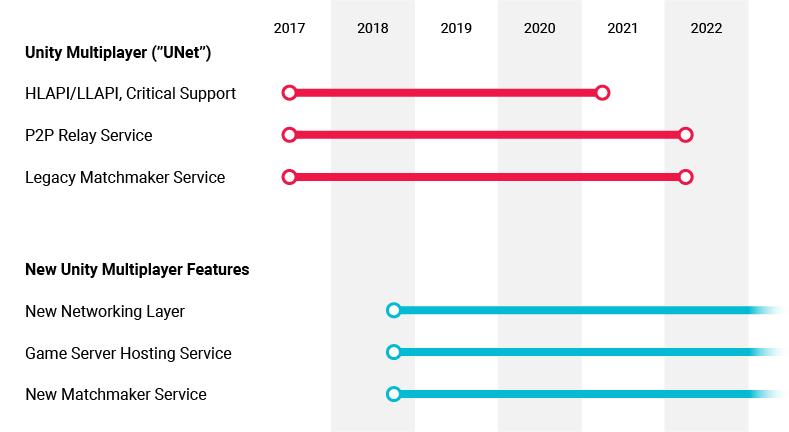
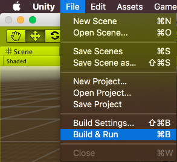
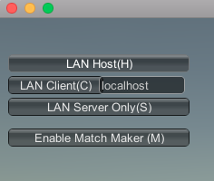
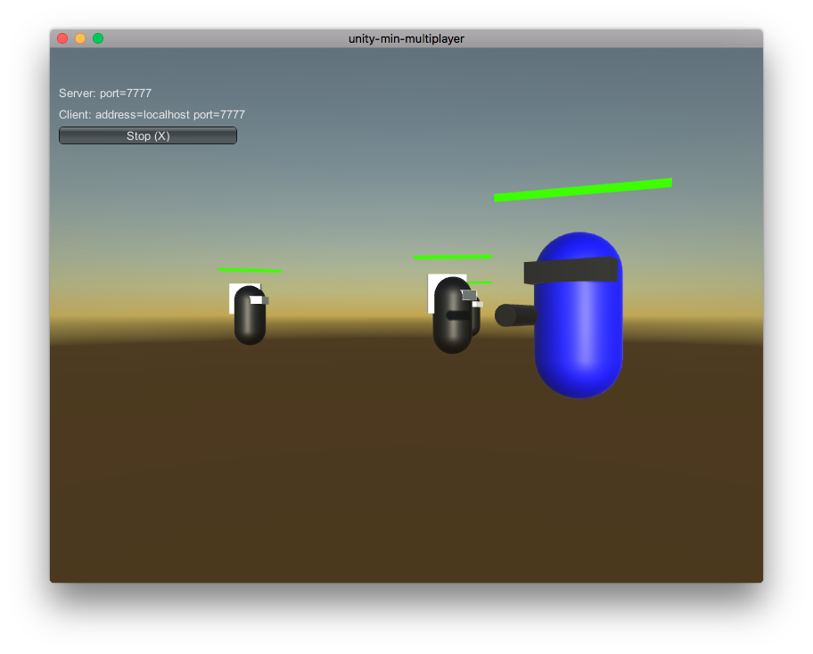
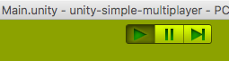
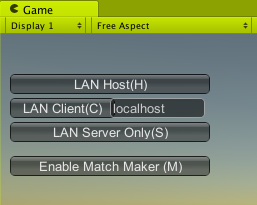
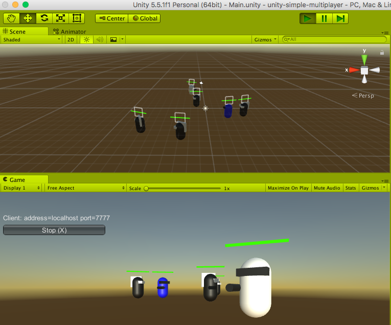

# Unity Simple Multiplayer using UNET

Result of the following tutorial 
[Simple Multiplayer Game - Unity 5.3](https://www.youtube.com/playlist?list=PLwyZdDTyvucw5JhBMJxFwsYc1EbQYxr0G)

UNET will be removed in 2021.



[FAQ](https://support.unity3d.com/hc/en-us/articles/360001252086-UNet-Deprecation-FAQ)

# Pre requirements

1. Unity 2019.2.0a11+

# How to Play

Open the **Main** Scene on Unity at

```
Scenes/Main
```

Server

```
File > Run & Build
```

At **Build/Build.app**



Click on LAN Host



Running at 7777




Client

```
Play
```



LAN Client



Running at 7777




# Reference

1. [Simple Multiplayer Game](https://unity3d.com/learn/tutorials/topics/multiplayer-networking/simple-game-summary?playlist=29690)
2. [Tutorial : Simple Multiplayer Game - Unity 5.3](https://www.youtube.com/playlist?list=PLwyZdDTyvucw5JhBMJxFwsYc1EbQYxr0G)
